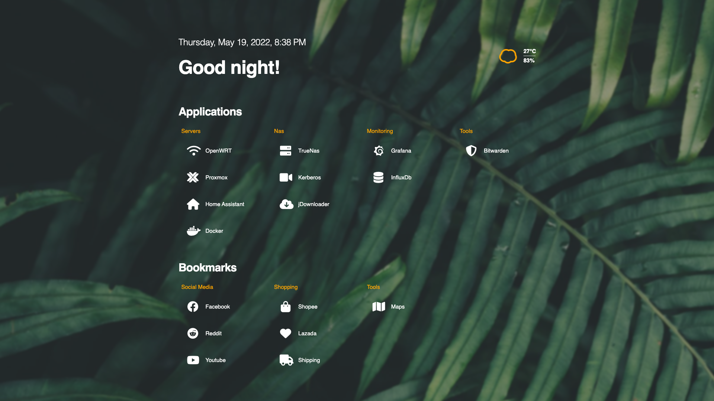

# Magma Dashboard
Personal dashboard that is highly customizable, lightweight and responsive.

## Features
* Lightweight (8-16Mb), fast, build from Go
* Support multiple [languages](https://magma.help14.com/#/customization/languages)
* Support multiple [themes](https://magma.help14.com/#/customization/themes)
* Addons support (WIP)

## How to use
* Download our [docker-compose.yml](./docker-compose.yml) file
* Start with `docker-compose up -d`
* Go to `data/config.yaml` to config your dashboard
* Go to `data/data.yaml` to edit your bookmarks
* See your dashboard at [localhost:7001](http://localhost:7001)

## Customization
Go to our [website](https://magma.help14.com) and read the document to  learn more.

## Contribution
Contributions welcome and needed!

## Thanks to
- pawelmalak for flame
- migueravila for simplefox
- u/Goldtom for flame css theme
